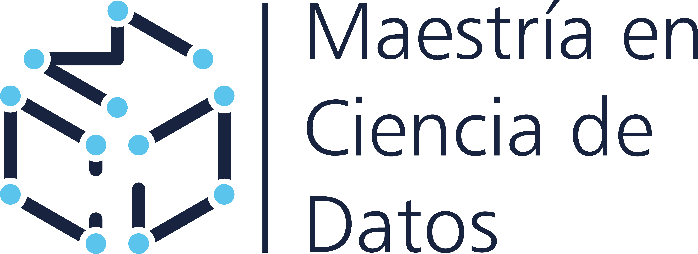

# Proyecto Aplicado II

Por: Christian Millán

**Universidad Virtual de la Universidad Tecnológica de la Mixteca**

*Maestría en Ciencia de Datos*

## Objetivo 

> Al termino del curso, el alumno será capaz de aplicar técnicas avanzadas de análisis y visualización de datos para extraer información útil y presentar resultados de manera efectiva, facilitando lo toma de decisiones basadas en datos. - plan de estudios.

> El alumno será capaz de aplicar técnicas avanzadas de análisis y visualización de datos para extraer información útil y presentar resultados de manera efectiva.  -Millán.

# Contenido

**Unidad 1.** [Introducción - Manipulación de datos](./1-intro/README.md)
- [1.1. Transformación de datos con Pandas](./1-intro/1-1-sort_filter/README.md)
- [1.3. Agregación de datos]()
- 1.4. Slicing e indexado de datos
- 1.5. Visualización de datos

Unidad 2. Análisis Exploratorio de Datos

2.1. Exploración inicial de los datos
2.2. Analisis Univariado
2.3. Análisis Bivariado
2.4. Análisis Multivariado

Unidad 3. Desarrollo de proyecto 